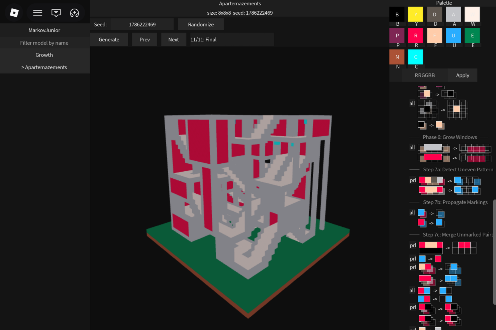

     

# MarkovLuau

A Luau port of **MarkovJunior** [(read more)](https://github.com/mxgmn/MarkovJunior). This package is mainly focused towards Roblox development. However, it is headless with no Roblox globals (`Random`, `Vector3`, `Instance`, `game`), file reads, or image decoding.

### Documentation is provided here: [Docs](docs/intro).

---

### This port also introduces some new features:

- **Programmatic DSL**: The `Author` module that allows building models and rule sequences directly in code.

- **Time Travel**: A snapshot driven `InterpreterState` that captures grid states during generation for step-by-step playback.

- **Grid Cell Locking**: A `Grid.LockMask` feature that allows predefined layout bounds to be locked, meaning rules can read them but not overwrite.

---

### What about the original XML?
*Don't want to use DSL?* An XML parser is included so you can return a string with XML and it will work just fine.

Every model in [MarkovJunior](https://github.com/mxgmn/MarkovJunior) should run, though things may look different due to different implementations of Random.

Examples
---

This also includes a couple of examples showing how you can define models. You can define them using the default XML syntax or the authored equivalent... it is your preference!

- **Growth**: A simple model that grows outwards.
- **Apartemazements**: A complex architecture model ported from MarkovJunior [(original here)](https://github.com/mxgmn/MarkovJunior/blob/main/models/Apartemazements.xml).

 
